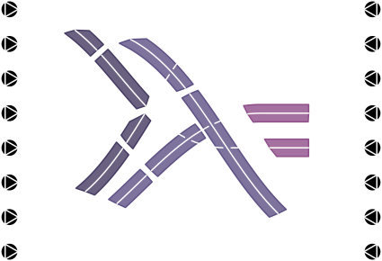

<p align="center">
  
</p>

## Synopsis

`pshash` is a pseudo-hash algorithm implemented in Haskell, JavaScript, and C/C++. It serves as a password manager by accepting three keys (one public and two private) and returning a pseudo-hash that can be used as a password. The program does not store the passwords anywhere, instead it generates them on the fly every time, which ensures a significant degree of security.

Various password templates are supported, and the user is free to define their own. These templates can then be stored in a configuration file, one template per public key. This way, the user can produce different types of passwords for different public keys, and does not have to keep all the templates inn their head.

The algorithm was designed to withstand brute-forcing as well. For finer detail, please refer to the corresponding mathematical paper: *documentation/main.pdf*

This repository contains the CLI version of the `pshash` algorithm, implemented in Haskell, the web version, written in JavaScript, and the standalone GUI version, written in C/C++. All versions implement the algorithm natively, with no foreign function interface.

## What do I mean by 'pseudo-hash'?

Strictly speaking, a cryptographic hash is a function that has a uniform distribution of output hashes (i.e. all outputs are equally likely to be produced, given a random input), and a function such that finding two inputs mapping to the same hash is computationally intractable. The `pshash` algorithm has the former property, yet lacks the latter. In fact, computing two sets of keys that map to the same hash under the `pshash` algorithm is trivial, and this functionality is implemented in this project. However, for the purposes of password production, it is sufficient for the task of _inverting_ the function to be intractable. In `pshash`, this is achieved through artificial collisions. This is why the algorithm requires _two_ keys instead of one. The first (_choice_) key is used to produce the hash string, and then the second (_shuffle_) key is further used to rearrange the string. This way, different combinations of choice-shuffle keys may result in the same final hash, and computing the exact one used by the user is a computationally intractable problem (see _documentation/main.pdf_ for details).

## Where can you generate the passwords?

### Web implementation

First of all, you can use the algorithm online at https://thornoar.github.io/pshash/web/app/.

### CLI tool

The `pshash` CLI tool adopts a wide range of local deployment options:
- You can install `pshash` from the AUR.
- You can build `pshash` with Nix flakes by invoking `nix build github:thornoar/pshash`, there are two relevant outputs: `#pshash-dynamic` for dynamic linking, and `#pshash-static` for static linking (will take a lot longer to build).
- You can build `pshash` with `cabal-install` by cloning this repo and running `cabal update && cabal install pshash`.
- You can simply download all the source code (the `app` and `lib` directories) and compile with
  ```bash
    ghc --make -i./src ./app/Main -o pshash
  ```
  Here you will have to make sure that the necessary libraries (i.e. `containers` and `directory`) are installed on your system.
- Finally, you can directly download the relevant pre-compiled executables from the `pshash-bin` repo: https://github.com/thornoar/pshash-bin. Binaries are also available at https://thornoar.github.io/pshash/web/app/.

### GUI application

The `pshash-gui` GUI application is available through the following channels:
- You can build `pshash-gui` with Nix flakes by invoking `nix build github:thornoar/pshash#pshash-gui`.
- You can download the `gui` directory from this repo and then compile `main.cpp` with
  ```bash
    g++ main.cpp -o pshash-gui $(wx-config --cxxflags --libs)
  ```
  (on UNIX-like systems). Note that the `wxWidgets` library must be installed on your system.

## Contact

Please contact me via email: `r.a.maksimovich@gmail.com`, or on Telegram/Instagram: `@thornoar`.
