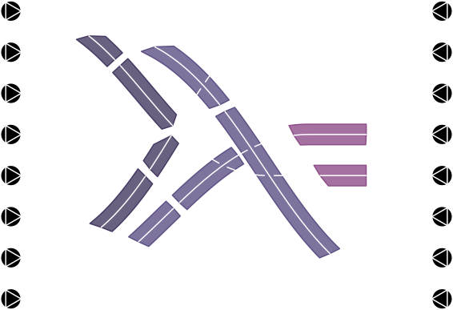

<p align="center">
  
</p>

## Synopsis

`pshash` is a pseudo-hash algorithm implemented in Haskell, JavaScript, Kotlin, and C/C++. It serves as a password manager by accepting three keys (one public and two private) and returning a pseudo-hash that can be used as a password. The program does not store the passwords anywhere, instead it generates them on the fly every time, which ensures a degree of security.

Various password templates (co-called "source configurations") are supported, and the user is free to define their own. These configurations can then be stored in a configuration file, one per public key. This way, the user can produce different types of passwords for different public keys, and does not have to keep all the templates in their head.

The algorithm was designed to withstand different kinds of brute-force attacks as well. For finer detail, please refer to the corresponding mathematical paper: *documentation/main.pdf*

This repository contains the CLI version of the `pshash` algorithm, implemented in Haskell. For access to other implementations, see sections below.

## What do I mean by 'pseudo-hash'?

Strictly speaking, a cryptographic hash should be preimage resistant and collision resistant. That is, a function such that finding a preimage of a given value is computationally intractable, and so is finding two inputs mapping to a same hash. The `pshash` algorithm has neither. In fact, computing two sets of keys that map to the same hash under the `pshash` algorithm is trivial, and this functionality is even implemented in the CLI tool. However, `pshash` does have the properties of a _universal hash function:_ given two public keys and a random pair of private keys, the probability of collision is negligible. The distribution of outputs given random inputs is also uniform, without statistical bias. For the purposes of password production, it is sufficient for the task of _completely inverting_ the function (i.e. finding _all_ preimages of a value) to be intractable. In `pshash`, this is achieved through artificial collisions. This is why the algorithm requires _two_ keys instead of one. The first (_choice_) key is used to produce the hash string, and then the second (_shuffle_) key is further used to rearrange the string. This way, different combinations of choice-shuffle keys may result in the same final hash, and computing the exact one used by the user is a computationally intractable problem (see _documentation/main.pdf_ for details).

## Where can you generate the passwords?

### Web Implementation

First of all, you can use the algorithm online at https://thornoar.github.io/pshash-web/app/.

### CLI Tool

The `pshash` CLI tool adopts a wide range of local deployment options:
- You can install `pshash` from the [AUR](https://aur.archlinux.org/packages/pshash).
- You can build `pshash` with Nix flakes by invoking `nix build github:thornoar/pshash`, there are two relevant outputs: `#pshash-dynamic` for dynamic linking, and `#pshash-static` for static linking (will take a lot longer to build). Naturally, the default is `pshash-dynamic`.
- You can build `pshash` with `cabal-install` by cloning this repo and running `cabal update && cabal install pshash`.
- You can simply download all the source code (the `app` and `lib` directories) and compile with
  ```bash
    ghc --make -i./lib -i./app ./app/Main.hs -o pshash
  ```
  Here you will have to make sure that the necessary packages (i.e. `containers`, `directory`, `bytestring`, and `random`) are installed on your system and available through `ghc`.
- Finally, you can directly download the relevant pre-compiled executables from the `pshash-bin` repo: https://github.com/thornoar/pshash-bin. Binaries are also available at https://thornoar.github.io/pshash-web/get/.

### GUI Application

The `pshash-gui` native GUI application is available through the following channels:
- You can build `pshash-gui` with Nix flakes by invoking `nix build github:thornoar/pshash-gui`.
- You can clone the `pshash-gui` repository at https://github.com/thornoar/pshash-gui and then compile with
  ```bash
    g++ -g -O \
      ./src/main.cpp \
      ./src/inputs.cpp \
      ./src/algorithm.c \
      ./src/mini-gmp.c \
      -o main $(wx-config --cxxflags --libs)
  ```
  (on UNIX-like systems), or just running `./build.sh`. Note that the `wxWidgets` library must be installed on your system.

### Android Application

The `pshash-app` native Android application's source is available at https://github.com/thornoar/pshash-app. You can clone the repository and build the Android Studio project, or get the APK files at https://thornoar.github.io/pshash-web/get/.

## Contact

Please contact me via email: `r.a.maksimovich@gmail.com`, or on Telegram/Instagram: `@thornoar`.
